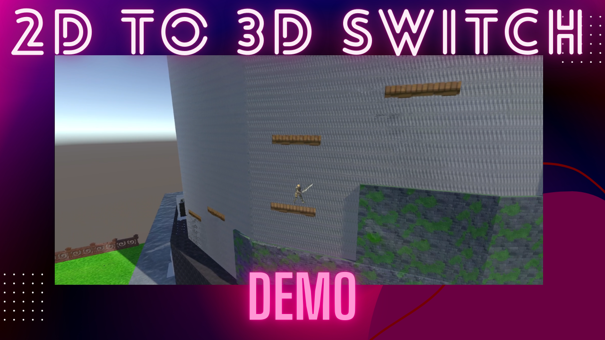

# unity-2D-3D-switch-demo

A demo of a Super Mario Odyssey feature replicated in Unity.

## Features

### Game:
- Dimensional switching from 3D to 2D
- Character import of the 3D model into 2D
- Attachment of the 2D model to the 3D world
- Animation conversion of the 3D model into 2D
- Camera switching from 3D to 2D
- Camera tracking of the 2D model in three-dimensional space
- Dimensional switching via a place value
- Switching of the control input between 3D and 2D

### Controls:
- Movement via W, A, S, and D
- Jumping via spacebar
- Camera panning via mouse
- Adaptive controls in 3D and 2D

### Animations:
- Idle
- Jump
- Run
- 3D and 2D synchronized

## Demo

 

## Gameplay Demo

## Tech

- Unity
- C#